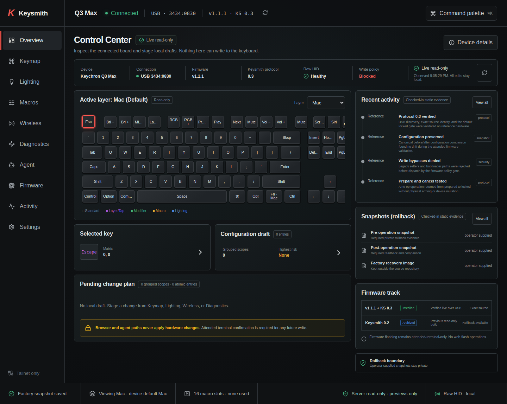
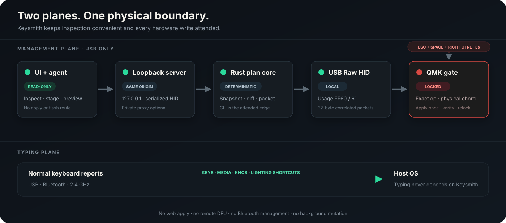
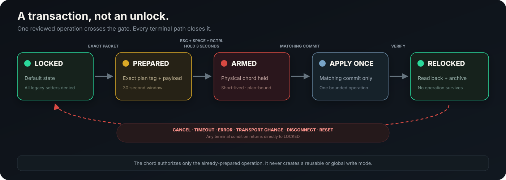
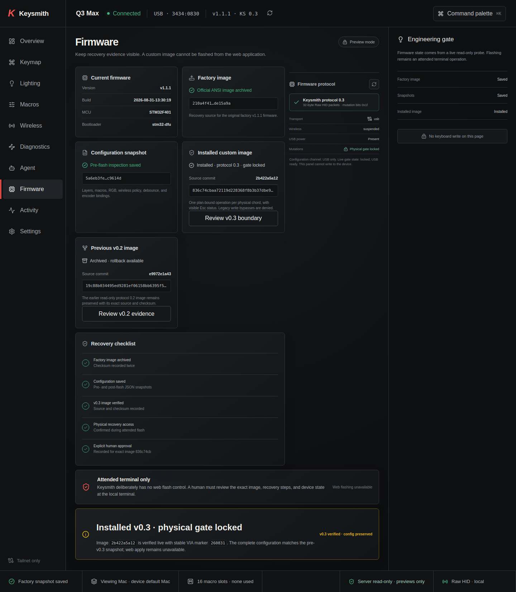
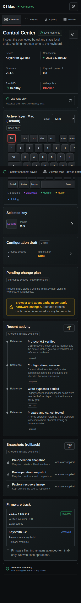

<p align="center">
  
</p>

<h1 align="center">Keysmith</h1>

<p align="center">
  A local-first control surface, CLI, and safety model for the
  <strong>Keychron Q3 Max</strong>.<br>
  See everything. Plan every change. Never flash from software.
</p>

<p align="center">
  <a href="https://github.com/karti-ai/keysmith/actions/workflows/ci.yml"></a>
  <a href="LICENSE"></a>
  
  
  
  
</p>

<p align="center">
  <a href="https://keychron.karti.ai/"><strong>Website</strong></a>
  ·
  <a href="#quick-start"><strong>Quick start</strong></a>
  ·
  <a href="#use-the-cli"><strong>CLI</strong></a>
  ·
  <a href="docs/V0_3_ATTENDED_PROTOCOL.md"><strong>Protocol</strong></a>
  ·
  <a href="https://github.com/karti-ai/keysmith-qmk"><strong>Firmware source</strong></a>
  ·
  <a href="SECURITY.md"><strong>Security</strong></a>
</p>

> [!NOTE]
> Keysmith is an early public source preview for technical Linux users. There
> is no packaged desktop installer or downloadable Keysmith firmware release
> yet. The public firmware candidate is compiled in CI; installation remains a
> separate advanced, attended workflow.

<p align="center">
  
</p>

## The idea

Keyboard configuration tools usually collapse discovery, editing, device
writes, and firmware updates into one opaque action. Keysmith separates them.

| Layer | What Keysmith does |
|---|---|
| **Observe** | Reads identity, firmware, layers, encoders, RGB, debounce, wireless policy, and privacy-safe macro metadata. |
| **Draft** | Keeps edits in browser-local state and shows explicit before/after scopes. |
| **Plan** | Builds deterministic, inspectable plans with risk and rollback evidence. |
| **Apply** | Writes configuration through a plan bound to one exact staged operation, and relocks after every commit. |
| **Recover** | Keeps snapshots and firmware recovery outside the public repository and outside the web server. |

The result feels like a modern keyboard IDE without turning a browser, remote
agent or background service into a firmware flasher.

Configuration and firmware are treated as different kinds of risk. Changing a
keycode, an RGB profile, an encoder binding, debounce or wireless timeouts is
recoverable in software: every change is planned against a snapshot and carries
its own rollback. Those apply directly. Flashing is not recoverable in software,
so it is not in the protocol at all -- DFU is entered by physically holding Esc
while reconnecting the keyboard, and no host tool can put the board there.

## What works today

| Capability | Status | Boundary |
|---|:---:|---|
| Live Q3 Max inspection | Ready | Read-only USB Raw HID |
| Four-layer keymap viewer | Ready | Accurate matrix, local selection |
| Lighting, macro, wireless, and diagnostics workspaces | Ready | Browser-local drafts |
| Immutable snapshots and deterministic plan diffs | Ready | Rust core |
| Plan compilation | Ready | Offline; opens no HID device |
| Configuration writes | Ready | Firmware 0.5+; plan-bound, relocks after each commit |
| macOS and Windows | Ready | Via hidapi; Linux uses hidraw |
| Browser/server apply | Intentionally absent | No route exists |
| Firmware flashing | Intentionally absent | Separate local DFU procedure |
| Bluetooth configuration transport | Not supported | Bluetooth remains a typing transport |

## Architecture

<p align="center">
  
</p>

The Rust protocol core is shared by the CLI and server. The server binds to
loopback and serves a same-origin React interface. Optional remote access sits
behind an authenticated private-network proxy; the application itself never
binds a public interface.

## Quick start

### 1. Install Linux HID access

Keysmith targets the Q3 Max USB device `3434:0830`. Install a scoped udev rule
so a local `plugdev` user can reach its hidraw interfaces without running the
application as root:

```udev
KERNEL=="hidraw*", SUBSYSTEM=="hidraw", ATTRS{idVendor}=="3434", ATTRS{idProduct}=="0830", MODE="0660", GROUP="plugdev", TAG+="uaccess"
```

Reconnect the keyboard after installing the rule. Keysmith discovers the
correct hidraw node by usage page `0xFF60` and usage `0x61`; it does not depend
on a fixed `/dev/hidrawN` path.

### 2. Build the app

```bash
git clone https://github.com/karti-ai/keysmith.git
cd keysmith

cd apps/web
npm ci
npm run build
cd ../..

cargo build --release -p keysmith-server -p keysmith-cli
```

### 3. Start locally

```bash
./target/release/keysmith-server
```

Open <http://127.0.0.1:3762>. The server exposes inspection and plan-preview
APIs plus the built web app. It has no apply, bootloader, DFU, or flash route.

## Use the CLI

The binary is named `keychronctl`:

```bash
# Human-readable inspection
./target/release/keychronctl inspect

# Machine-readable inventory and firmware probe
./target/release/keychronctl inspect --json
./target/release/keychronctl firmware-probe --json

# Portable read-only configuration snapshot
./target/release/keychronctl snapshot --json > before.json
```

Build and inspect a deterministic local plan:

```bash
./target/release/keychronctl plan create \
  --baseline before.json \
  --target draft.json \
  --json > plan.json

./target/release/keychronctl plan inspect --file plan.json
./target/release/keychronctl plan prepare --file plan.json --json
```

`plan prepare` is an offline compiler. It prints candidate v0.3 packets and
never opens the keyboard.

Apply it when you are satisfied:

```sh
./target/release/keychronctl apply --file plan.json --dry-run
./target/release/keychronctl apply --file plan.json
```

Or skip the file entirely and use a scene, which plans against the live board:

```sh
./target/release/keychronctl scene capture before-my-change
./target/release/keychronctl set rgb --hue 160 --dry-run
./target/release/keychronctl set rgb --hue 160
./target/release/keychronctl scene apply before-my-change   # undo
```

`keychronctl doctor` reports what is connected and what is possible, and exits
0 when writes are available, 1 when the board is read-only and 2 when no board
was found, so a script can branch without parsing output.

## The firmware gate

The companion [Keysmith QMK fork](https://github.com/karti-ai/keysmith-qmk)
implements a narrow, USB-only transaction protocol. Firmware begins locked,
accepts one exact prepared operation, requires a three-second physical chord,
accepts one matching commit, applies once, verifies, and relocks.

<p align="center">
  
</p>

The web server stops at inspection and plan preview. It has no apply route, and
the CLI is the only thing that writes. Firmware flashing is not exposed by any
component
capability. See the complete
[v0.3 protocol specification](docs/V0_3_ATTENDED_PROTOCOL.md).

## Product tour

<table>
  <tr>
    <td width="66%"></td>
    <td><strong>Firmware workspace</strong><br><br>Live protocol status, source identity, recovery evidence, and an explicit attended-only engineering gate. There is no web flash button.</td>
  </tr>
  <tr>
    <td width="66%"></td>
    <td><strong>Responsive control center</strong><br><br>The same inspection and draft model remains usable on a private phone or tablet connection without changing the hardware trust boundary.</td>
  </tr>
</table>

## Private-network access

Keysmith always listens on `127.0.0.1:3762`. If another device needs the UI,
place loopback behind an authenticated private proxy such as Tailscale Serve;
never publish port `3762` directly.

<details>
<summary><strong>Example Tailscale deployment</strong></summary>

The checked-in [`keysmith.service.example`](deploy/keysmith.service.example)
expects a checkout at `~/.local/share/keysmith`:

```bash
cd ~/.local/share/keysmith/apps/web
npm ci && npm run build
cd ../..
cargo build --release -p keysmith-server -p keysmith-cli
systemctl --user restart keysmith.service
```

Expose it only on the authenticated tailnet:

```text
https://your-device.your-tailnet.ts.net:8463/
```

Inspect or remove that route with:

```bash
tailscale serve status
tailscale serve --https=8463 off
```

</details>

## Repository map

```text
keysmith/
├── crates/
│   ├── keysmith-core/    # HID discovery, protocol decoding, snapshots, plans
│   ├── keysmith-cli/     # keychronctl read-only and offline-plan commands
│   └── keysmith-server/  # loopback-only API and static web serving
├── apps/web/             # Private React control surface
├── apps/site/            # Static public launch site
├── docs/                 # protocol, hardware, design, and visual references
└── deploy/               # generic user-service example
```

Firmware lives separately in
[`karti-ai/keysmith-qmk`](https://github.com/karti-ai/keysmith-qmk) so its
upstream GPL history, license notices, and complete build inputs remain intact.

## Develop and verify

```bash
cargo fmt --all -- --check
cargo test --workspace --locked
cargo clippy --workspace --all-targets --locked -- -D warnings
cargo deny check

cd apps/web
npm ci
npm audit --audit-level=high
npm run build
```

GitHub CI runs those Rust, dependency-policy, and web checks on every push and
pull request. Contributions should keep protocol behavior deterministic and the
trust boundary narrow. Read [`CONTRIBUTING.md`](CONTRIBUTING.md) before adding a
new operation.

## Privacy and security

- No device dumps, factory images, firmware binaries, pairing data, or private
  configuration snapshots belong in this repository.
- The loopback API does not grant cross-origin browser access.
- Macro contents remain intentionally private during normal inspection.
- Browser and agent paths cannot apply hardware state or invoke a bootloader.
- Vulnerabilities that could bypass these properties should use GitHub private
  vulnerability reporting. See [`SECURITY.md`](SECURITY.md).

## Hardware and licensing

Validated hardware is the Keychron Q3 Max ANSI encoder with STM32F401, USB
VID/PID `3434:0830`, and the Keychron `v1.1.1` firmware line. Hardware findings
and wireless limitations are documented in
[`docs/DEVICE_NOTES.md`](docs/DEVICE_NOTES.md).

The Rust/React application is [MIT licensed](LICENSE). Firmware source remains
in the separate GPL Keychron/QMK fork with its upstream notices intact.
Keysmith additions are GPL-2.0-or-later; the combined ARM image also links
GPLv3 ChibiOS and must be distributed under GPLv3 with complete corresponding
source and build inputs.

Keysmith is an independent community project and is not affiliated with or
endorsed by Keychron, QMK, or VIA.
